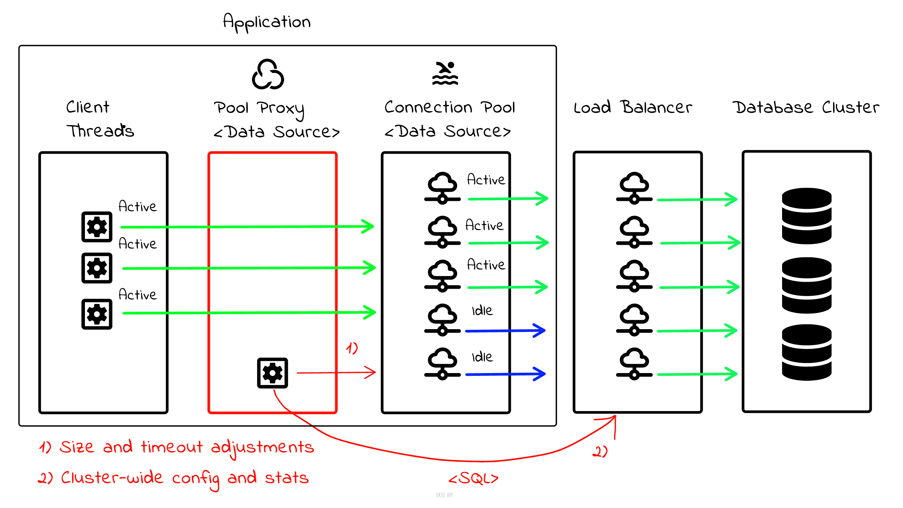

[](https://github.com/kai-niemi/pool-proxy/actions/workflows/maven.yml)

<!-- TOC -->
* [About](#about)
  * [Main features](#main-features)
  * [Compatibility](#compatibility)
  * [How to use](#how-to-use)
* [Building](#building)
  * [Install the JDK](#install-the-jdk)
  * [Clone the project](#clone-the-project)
  * [Build the artifact](#build-the-artifact)
* [Terms of Use](#terms-of-use)
<!-- TOC -->

# About

A simple database connection pool proxy library for CockroachDB. It configures the pool size 
and timeouts based on CockroachDB [production guidelines](https://www.cockroachlabs.com/docs/v25.3/connection-pooling?filters=advanced#size-connection-pools) 
relative to cluster provisioning and node availability. 

In addition, it periodically adjusts the pool size based on 
current node availability and aggregated pool metrics. Thus, the goal is to provide
a fair distribution of pool quotas based on active application (pool) instances and
total cluster vCPU count.

The following diagram illustrates the concept. A pool proxy wraps a target connection 
pool datasource like HikariCP. Connection acquisition and all other mechanics are passed 
through directly to the target datasource. The proxy only adjusts the `minIdle` and 
`maxPoolSize` settings and `maxLifetime` that should be lower than any database imposed 
connection timeout.



## Main features

- Supports HikariCP
- Supports C3P0
- Dynamic and fixed size pool sizing strategies
- Database driven pool configuration and statistics aggregation

## Compatibility

- JDK21+
- MacOS / Linux
- CockroachDB
- Spring Boot 3.x

## How to use
           
Example usage in a spring boot bean configuration. The pool name is used to uniquely identify 
the pool instance across a fleet of multiple apps and pools (recommended). If no name is assigned, an ephemeral 
UUID is used instead scoped to the app life cycle.

```java
@Configuration
@EnableTransactionManagement(proxyTargetClass = true)
public class JpaConfig {
    @Bean
    @ConfigurationProperties("spring.datasource")
    public DataSourceProperties dataSourceProperties() {
        return new DataSourceProperties();
    }

    @Bean
    @Primary
    public DataSource primaryDataSource() {
        return hikariDataSourceProxy(targetDataSource());
    }

    @Bean
    public HikariDataSourceProxy hikariDataSourceProxy(HikariDataSource hikariDataSource) {
        HikariDataSourceProxy hikariDataSourceProxy = new HikariDataSourceProxy(hikariDataSource);
        hikariDataSourceProxy.setPoolName(hikariDataSource.getPoolName());
        return hikariDataSourceProxy;
    }

    @Bean
    @ConfigurationProperties("spring.datasource.hikari")
    public HikariDataSource targetDataSource() {
        HikariDataSource ds = dataSourceProperties()
                .initializeDataSourceBuilder()
                .type(HikariDataSource.class)
                .build();
        ds.setPoolName("pool-proxy-test");
        ds.addDataSourceProperty("reWriteBatchedInserts", true);
        ds.addDataSourceProperty("ApplicationName", "pool-proxy-test");
        return ds;
    }
}
```
            
The table schema used by the library is available [here](pool-proxy-core/src/main/resources/db/schema-cockroachdb.sql).

# Building

## Install the JDK

MacOS (using sdkman):

    curl -s "https://get.sdkman.io" | bash
    sdk list java
    sdk install java 21.0 (pick version)  

Ubuntu:

    sudo apt-get install openjdk-21-jdk

## Clone the project

    git clone git@github.com:kai-niemi/pool-proxy && cd pool-proxy

## Build the artifact

    chmod +x mvnw
    ./mvnw clean install

# Terms of Use

This tool is not supported by Cockroach Labs. Use of this tool is entirely at your
own risk and Cockroach Labs makes no guarantees or warranties about its operation.

See [MIT](LICENSE.txt) for terms and conditions.
